# \# 🌶️ Chili Expert — Sistem Pakar Diagnosa Penyakit Tanaman Cabai

Chili Expert adalah **sistem pakar berbasis web** yang dirancang untuk membantu petani, pelajar, maupun masyarakat umum dalam **mendeteksi penyakit pada tanaman cabai secara cepat dan akurat**.  
Sistem ini memanfaatkan **pengetahuan pakar (knowledge base)** serta **mesin inferensi (inference engine)** untuk memberikan **diagnosa otomatis** berdasarkan gejala yang diinputkan pengguna.

Proyek ini dikembangkan dalam rangka tugas mata kuliah **Kecerdasan Buatan (AI)** oleh **Kelompok 7**.

---

## 👩‍💻 Kelompok 7

1. **Muhammad Caesar Aidarus**
2. **Abdullah Asy-Syifawi**
3. **Naufal Farrel Syafilan**
4. **Thahira Riska**
5. **Riyan Hadi Samudra**
6. **Davina Aura**
7. **Shafa Disya Aulia**

---

## 🧠 Deskripsi Sistem

Sistem ini bekerja seperti **seorang ahli pertanian digital**.  
Ketika pengguna memilih beberapa **gejala yang dialami oleh tanaman cabai**, sistem akan memproses data tersebut melalui:

1. **Basis Pengetahuan (Knowledge Base):** berisi kumpulan aturan (rules) dan gejala-gejala penyakit.
2. **Mesin Inferensi (Inference Engine):** melakukan penalaran berbasis aturan untuk menemukan penyakit paling mungkin.
3. **Basis Data (Database):** menyimpan daftar gejala, penyakit, dan hasil diagnosa pengguna.
4. **Antarmuka (UI):** dibuat menggunakan framework modern agar mudah digunakan oleh siapa pun.

Tujuan utama Chili Expert adalah:

- Membantu petani mendiagnosa penyakit cabai tanpa perlu selalu berkonsultasi langsung dengan pakar.
- Menjadi sarana pembelajaran interaktif bagi mahasiswa dan siswa untuk memahami penerapan sistem pakar di dunia nyata.

---

## ⚙️ Cara Instalasi dan Menjalankan

### 🔹 1. Clone atau Unduh Proyek

```bash
git clone [https://github.com/shafadisyaaulia/UTS_PrakAI_Kelompok7.git](https://github.com/shafadisyaaulia/UTS_PrakAI_Kelompok7.git)
cd UTS_PrakAI_Kelompok7
```


### 🔹 2. Instalasi Backend (Flask)

Masuk ke folder backend:

```bash
cd backend
```

Buat virtual environment (opsional tapi disarankan):

```bash
python -m venv venv
venv\Scripts\activate       # untuk Windows
source venv/bin/activate    # untuk macOS/Linux
```

Instal semua dependensi:

```bash
pip install -r requirements.txt
```

Jalankan server backend:

```bash
python app.py
```

Server akan berjalan di:

```
[http://127.0.0.1:5000](http://127.0.0.1:5000)
```


---

### 🔹 3. Instalasi Frontend (React + Vite)

Masuk ke folder antarmuka pengguna:

```bash
cd ../chili-expert-ui
```

Instal dependensi frontend:

```bash
npm install
```

Jalankan aplikasi:

```bash
npm run dev
```

Setelah berhasil, buka di browser:

```
http://localhost:5173
```


---

### 🔹 4. Struktur Proyek

```
chili-expert/
├── backend/       # Folder backend (Flask API)
│   ├── app.py
│   ├── requirements.txt
│   └── modules/
│       ├── knowledge_base.py
│       ├── inference_engine.py
│       └── ...
│
├── chili-expert-ui/            # Folder frontend (React + Vite)
│   ├── src/
│   │   ├── api/
│   │   ├── components/
│   │   ├── assets/
│   │   └── App.jsx
│   └── public/
│       └── cabai.avif
│
└── README.md
```


---

## 🧩 Fitur-Fitur Utama

### 🔹 1. Diagnosa Otomatis

Pengguna dapat memilih beberapa gejala yang dialami tanaman cabai.  
Sistem akan memberikan hasil diagnosis berupa **nama penyakit**, **penjelasan singkat**, dan **solusi penanganan**.

### 🔹 2. Manajemen Basis Pengetahuan

Admin atau pakar dapat:

- Menambahkan gejala baru
- Menambah, mengubah, atau menghapus aturan (rules)
- Memperbarui data penyakit


### 🔹 3. Tampilan Interaktif dan Responsif

Antarmuka dibuat dengan **React + TailwindCSS**, memberikan pengalaman modern, ringan, dan mudah diakses di berbagai perangkat.

### 🔹 4. Hasil Diagnosa yang Dapat Diekspor

Pengguna dapat mengekspor hasil diagnosa ke **PDF atau laporan digital** untuk keperluan dokumentasi.

### 🔹 5. Visualisasi Data (Opsional)

Tersedia fitur tambahan untuk menampilkan grafik penyakit dan gejala paling sering muncul menggunakan **matplotlib** dan **plotly**.

---

## 🖼️ Screenshot / Demo

### 🌱 Halaman Diagnosa


### 📊 Halaman Aturan (Rules)


### 🧾 Hasil Diagnosa


> *(Letakkan gambar di folder `chili-expert-ui/public/screenshots/` dan sesuaikan path di atas.)*

---

## 💡 Teknologi yang Digunakan

| Komponen | Teknologi |
| :-- | :-- |
| **Frontend** | React, Vite, TailwindCSS, React Hot Toast |
| **Backend** | Flask, Flask-CORS |
| **Basis Data** | JSON / Local Storage |
| **Visualisasi** | Matplotlib, Plotly |
| **Export Report** | ReportLab, FPDF |
| **Bahasa Pemrograman** | Python \& JavaScript |


---

## 🧾 Lisensi

Proyek ini dikembangkan untuk tujuan akademik.  
Dilarang memperjualbelikan atau menyebarkan tanpa izin seluruh anggota **Kelompok 7**.

---

### ✨ *"Empowering Farmers with Intelligent Agriculture Solutions."*

revisi readme dong

Berikut **README.md yang sudah direvisi** dan disesuaikan dengan sistem pakar pemupukan cabai yang sebenarnya Anda kembangkan, termasuk fitur-fitur yang sudah ready, teknologi yang digunakan, dan struktur yang lebih jelas:

***

# 🌶️ **Chili Expert — Sistem Pakar Pemupukan Tanaman Cabai**

**Chili Expert** adalah sistem pakar berbasis web yang dirancang untuk membantu petani, agronomist, dan praktisi pertanian dalam **mendiagnosis masalah nutrisi tanaman cabai** dan memberikan **rekomendasi pemupukan yang tepat dan akurat**.

Sistem ini memanfaatkan **Knowledge Base** dengan 21 rules tervalidasi, **Inference Engine** berbasis Forward Chaining, dan **Certainty Factor** untuk memberikan diagnosis probabilistik berdasarkan gejala yang diamati.

Proyek ini dikembangkan dalam rangka tugas mata kuliah **Kecerdasan Buatan (AI)** oleh **Kelompok 7**.

***

## 👥 **Kelompok 7**

| Nama | Role |
| :-- | :-- |
| **Muhammad Caesar Aidarus** | Knowledge Acquisition \& UI Testing |
| **Abdullah Asy-Syifawi** | Certainty Factor Implementation |
| **Naufal Farrel Syafilan** | Knowledge Base \& Rules Management |
| **Thahira Riska** | Data Management \& Utilities |
| **Riyan Hadi Samudra** | Backend Integration \& API |
| **Davina Aura** | Explanation Facility |
| **Shafa Disya Aulia** | Frontend UI/UX \& Demo |


***

## 🧠 **Deskripsi Sistem**

Sistem ini bekerja seperti **konsultan pertanian digital** yang membantu mendiagnosis masalah nutrisi tanaman cabai berdasarkan gejala visual dan fase pertumbuhan.

### **Cara Kerja:**

1. **Input:** User memilih fase pertumbuhan dan gejala yang diamati (daun kuning, pertumbuhan lambat, dll.) dengan tingkat keyakinan.
2. **Processing:** Sistem memproses input menggunakan:
    - **Knowledge Base:** 21 rules tervalidasi dari Balai Penelitian Tanaman Sayuran
    - **Inference Engine:** Forward Chaining untuk menemukan diagnosis yang cocok
    - **Certainty Factor:** Menghitung tingkat keyakinan diagnosis (CF = CF_user × CF_expert)
3. **Output:** Sistem memberikan:
    - Diagnosis masalah nutrisi dengan persentase keyakinan
    - Rekomendasi pupuk lengkap (jenis, dosis, metode aplikasi, waktu, precaution)
    - Explanation (HOW \& WHY) tentang proses reasoning
    - PDF report yang bisa di-download

### **Tujuan Utama:**

- Membantu petani mendiagnosis masalah nutrisi tanpa harus selalu berkonsultasi dengan ahli
- Memberikan rekomendasi pemupukan yang spesifik dan actionable
- Menjadi tool pembelajaran interaktif untuk memahami sistem pakar di dunia nyata

***

## ⚙️ **Cara Instalasi dan Menjalankan**

### **Prerequisites**

- Python 3.8+ (untuk backend)
- Node.js 16+ dan npm/yarn (untuk frontend)
- Git (untuk clone repository)

***

### **🔹 1. Clone Repository**

```bash
git clone https://github.com/shafadisyaaulia/UTS_PrakAI_Kelompok7.git
cd UTS_PrakAI_Kelompok7
```


***

### **🔹 2. Setup Backend (Flask API)**

#### **Masuk ke folder backend:**

```bash
cd backend
```


#### **Buat virtual environment:**

```bash
python -m venv venv

# Windows
venv\Scripts\activate

# macOS/Linux
source venv/bin/activate
```


#### **Install dependencies:**

```bash
pip install -r requirements.txt
```


#### **Jalankan backend server:**

```bash
python app.py
```

Server akan berjalan di: **`http://127.0.0.1:5000`**

***

### **🔹 3. Setup Frontend (React + Vite)**

#### **Masuk ke folder frontend:**

```bash
cd ../chili-expert-ui
```


#### **Install dependencies:**

```bash
npm install
```


#### **Jalankan development server:**

```bash
npm run dev
```

Frontend akan berjalan di: **`http://localhost:5173`**

***

### **🔹 4. Struktur Proyek**

```
chili-expert/
├── backend/                      # Flask API Backend
│   ├── app.py                   # Main API server
│   ├── rules.json               # Knowledge Base (21 rules)
│   ├── requirements.txt         # Python dependencies
│   ├── modules/                 # Backend modules
│   │   ├── knowledge_base.py    # Knowledge Base management
│   │   ├── inference_engine.py  # Forward Chaining engine
│   │   ├── certainty_factor.py  # CF calculation
│   │   ├── explanation.py       # Explanation Facility (HOW/WHY)
│   │   ├── knowledge_acq.py     # CRUD rules
│   │   ├── consultation_logger.py
│   │   ├── pdf_exporter.py
│   │   ├── report_generator.py
│   │   └── format_helper.py
│   └── data/                    # Consultation history storage
│
├── chili-expert-ui/             # React + Vite Frontend
│   ├── src/
│   │   ├── api/                 # API service layer
│   │   ├── App.jsx              # Main app component
│   │   └── main.jsx
│   ├── public/
│   │   └── cabai.avif          # App logo
│   ├── package.json
│   └── vite.config.js
│
└── README.md
```


***

## 🎯 **Fitur-Fitur Utama**

### **✅ 1. Diagnosis Otomatis dengan Certainty Factor**

- User memilih gejala dan tingkat keyakinan (Tidak Yakin, Cukup Yakin, Yakin, Sangat Yakin)
- Sistem menghitung CF gabungan dan memberikan diagnosis dengan persentase keyakinan
- Support multiple conclusions jika ada beberapa diagnosis dengan CF comparable


### **✅ 2. Rekomendasi Pemupukan Lengkap**

Untuk setiap diagnosis, sistem memberikan:

- Jenis pupuk yang direkomendasikan (Urea, SP-36, KCl, dll.)
- Dosis per hektar dan per tanaman
- Metode aplikasi (kocor, tabur, semprot)
- Waktu aplikasi optimal
- Precaution dan catatan penting


### **✅ 3. Explanation Facility**

- **HOW Explanation:** Menjelaskan langkah-langkah reasoning dan rules yang digunakan
- **WHY Explanation:** Menjelaskan relevansi gejala terhadap diagnosis
- **Rule Details:** Informasi lengkap tentang setiap rule yang di-trigger


### **✅ 4. Knowledge Acquisition (CRUD Rules)**

Admin dapat:

- **Add** rule baru dengan auto-generated Rule ID
- **Edit** rule existing (CF dan explanation)
- **Delete** rule dengan confirmation
- **View** semua rules dengan detail lengkap


### **✅ 5. Dashboard Analytics**

- Statistics cards (Total Rules, Unique Diagnoses, Average CF)
- Pie chart distribusi diagnosis
- Bar chart average CF per kategori nutrisi
- Line chart CF range distribution


### **✅ 6. Consultation History \& PDF Export**

- Semua konsultasi tersimpan dengan consultation ID unik dan timestamp
- Re-download PDF capability dari history
- PDF report dengan layout professional


### **✅ 7. Advanced Search \& Filter**

- Search rules by ID, diagnosis, gejala, atau pupuk
- Real-time filtering
- Clean and intuitive UI

***

## 💻 **Teknologi yang Digunakan**

| Komponen | Teknologi |
| :-- | :-- |
| **Frontend** | React 18, Vite, TailwindCSS |
| **UI Components** | Lucide React Icons, React Hot Toast |
| **Backend** | Flask, Flask-CORS |
| **Inference** | Forward Chaining, Certainty Factor |
| **Data Storage** | JSON (Knowledge Base), CSV (Consultation Log) |
| **Export** | ReportLab (PDF generation) |
| **Visualization** | Chart.js (Frontend), Matplotlib (Backend) |
| **Languages** | Python 3.8+, JavaScript (ES6+) |


***

## 📊 **Knowledge Base**

Sistem ini memiliki **21 validated rules** yang mencakup:

- **Defisiensi Nutrisi:** Nitrogen (N), Fosfor (P), Kalium (K), Magnesium (Mg), Kalsium (Ca), Boron (B), Zinc (Zn), Copper (Cu)
- **Kelebihan Nutrisi:** Nitrogen berlebih, Overdosis pupuk kimia
- **Masalah Penyakit:** Antraknosa, Virus Kuning, Layu Bakteri
- **Masalah Lainnya:** Keracunan Herbisida

Setiap rule memiliki:

- **IF conditions** (antecedents/gejala)
- **THEN consequent** (diagnosis + rekomendasi lengkap)
- **CF (Certainty Factor)** dari expert
- **Explanation** detail

***

## 🎥 **Video Demo**

[Link to demo video] *(Coming soon)*

***

## 📸 **Screenshots**

## 📸 Screenshots

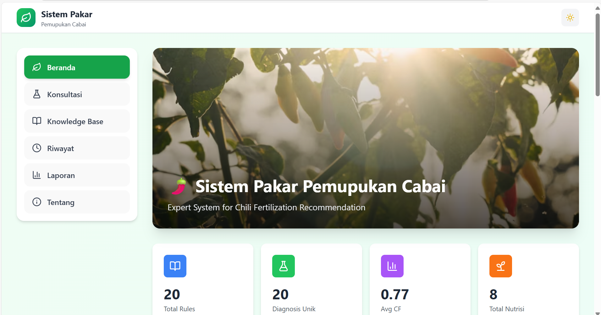
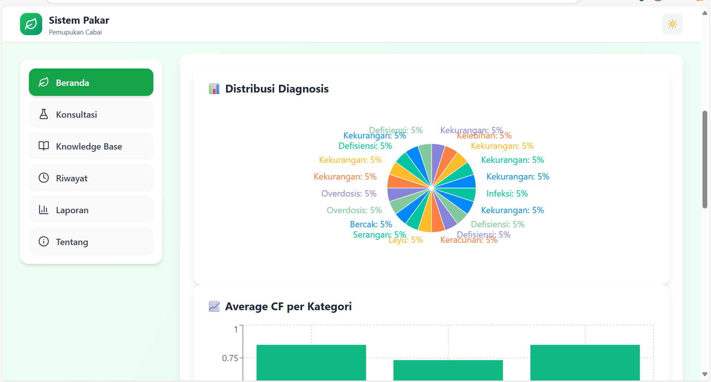
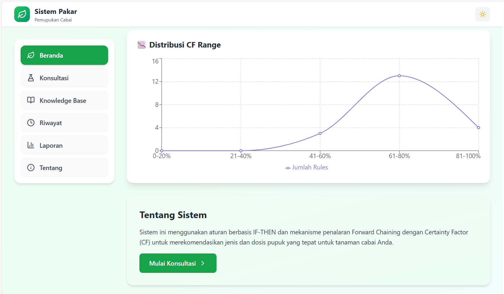
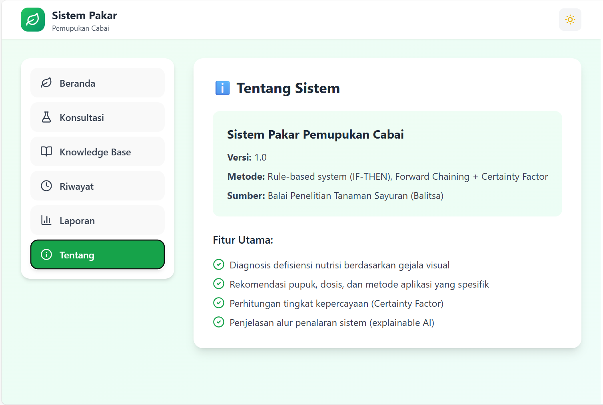
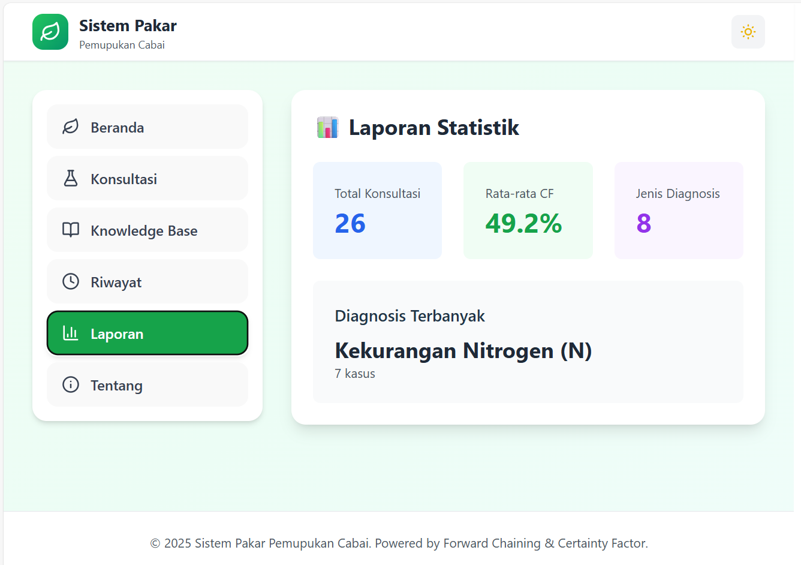
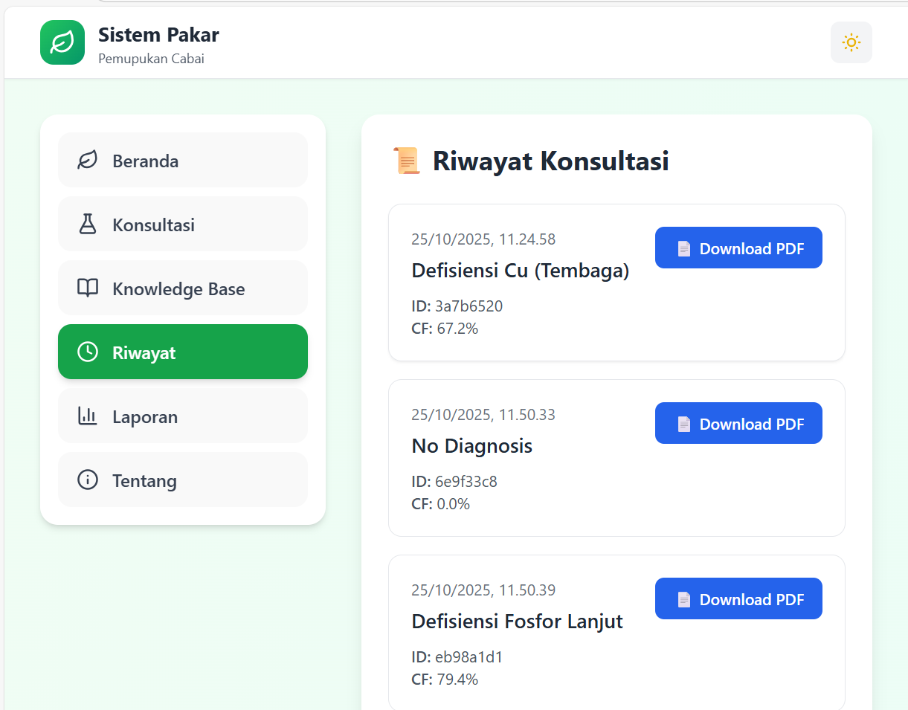
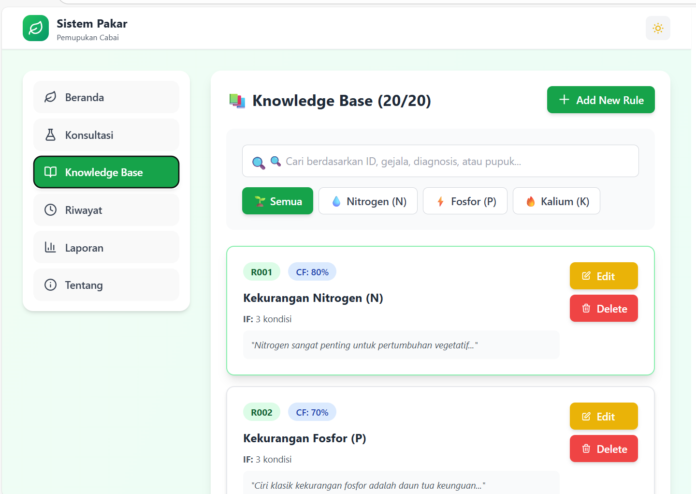
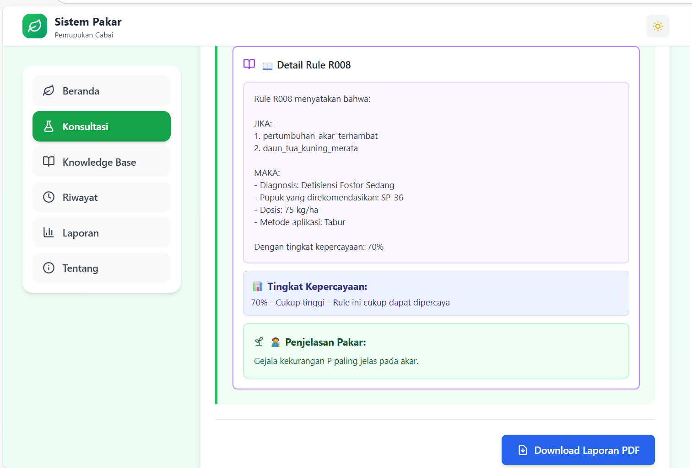
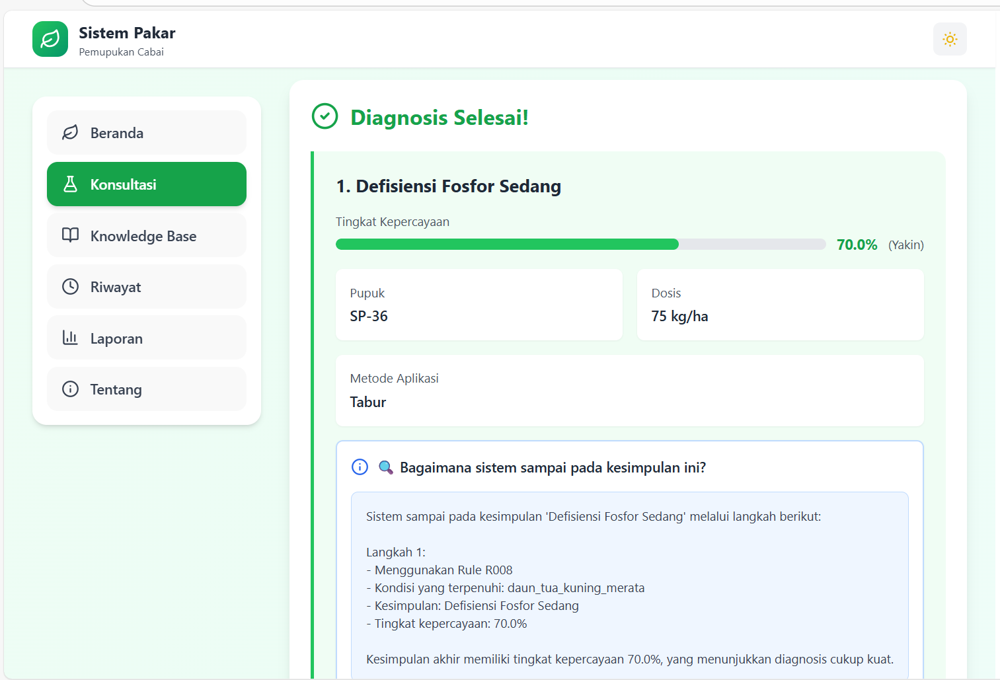
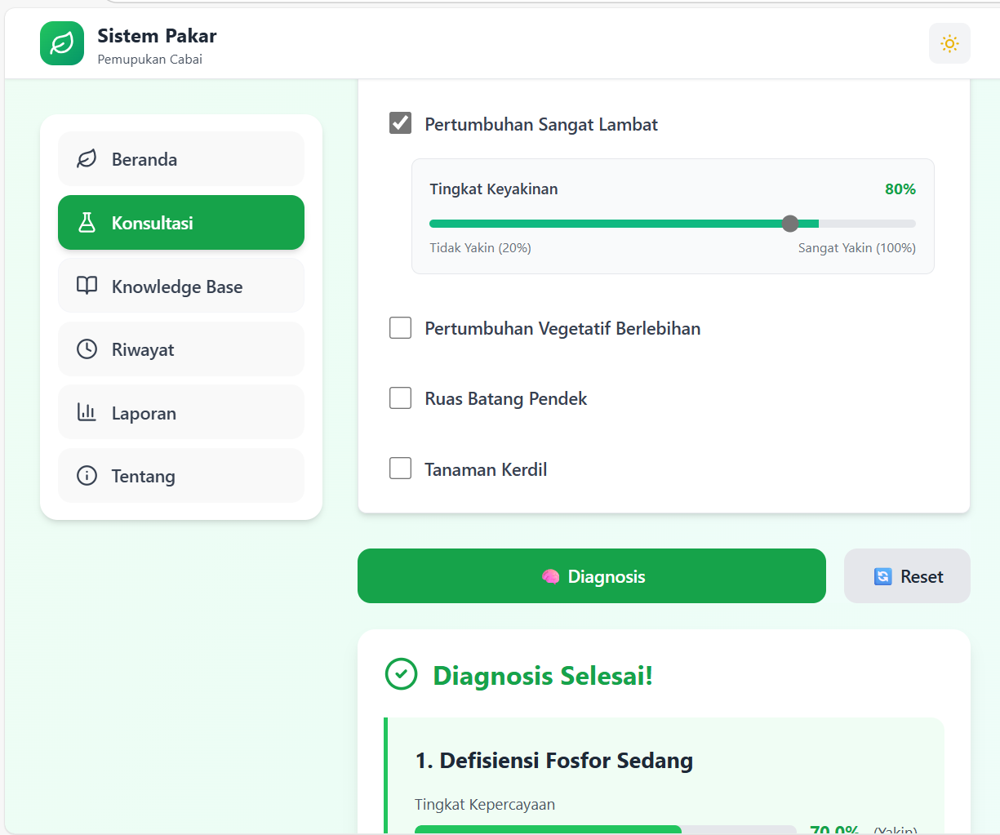
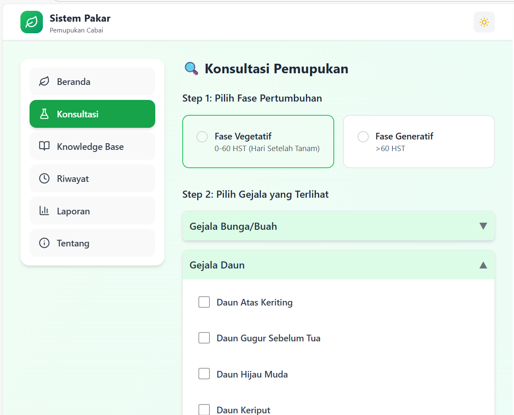

***

## 🚀 **API Endpoints**

| Method | Endpoint | Description |
| :-- | :-- | :-- |
| GET | `/api/symptoms` | Get all available symptoms |
| GET | `/api/statistics` | Get system statistics |
| POST | `/api/diagnose` | Run diagnosis with selected symptoms |
| POST | `/api/explain/why` | Get WHY explanation |
| GET | `/api/explain/rule/<rule_id>` | Get rule details |
| GET | `/api/rules` | Get all rules |
| POST | `/api/rules` | Add new rule |
| PUT | `/api/rules/<rule_id>` | Update rule |
| DELETE | `/api/rules/<rule_id>` | Delete rule |
| POST | `/api/export/pdf` | Export consultation to PDF |
| GET | `/api/history` | Get consultation history |


***

## 📝 **License**

Proyek ini dikembangkan untuk tujuan **akademik** sebagai tugas mata kuliah Kecerdasan Buatan.

**© 2025 Kelompok 7 - All Rights Reserved**

Dilarang memperjualbelikan atau mendistribusikan ulang tanpa izin dari seluruh anggota kelompok.

***

## 🙏 **Acknowledgments**

- **Balai Penelitian Tanaman Sayuran (Balitsa)** - Sumber data dan validasi rules
- **Dosen Pengampu Mata Kuliah AI** - Bimbingan dan feedback
- **Open Source Community** - Tools dan libraries yang digunakan

***

## 📞 **Contact**

Untuk pertanyaan atau feedback, hubungi:


- **GitHub:** [https://github.com/shafadisyaaulia/UTS_PrakAI_Kelompok7](https://github.com/shafadisyaaulia/UTS_PrakAI_Kelompok7)

***

### ✨ *"Empowering Farmers with Intelligent Agriculture Solutions"*
